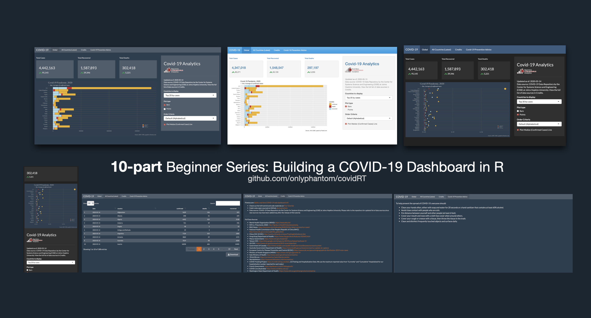
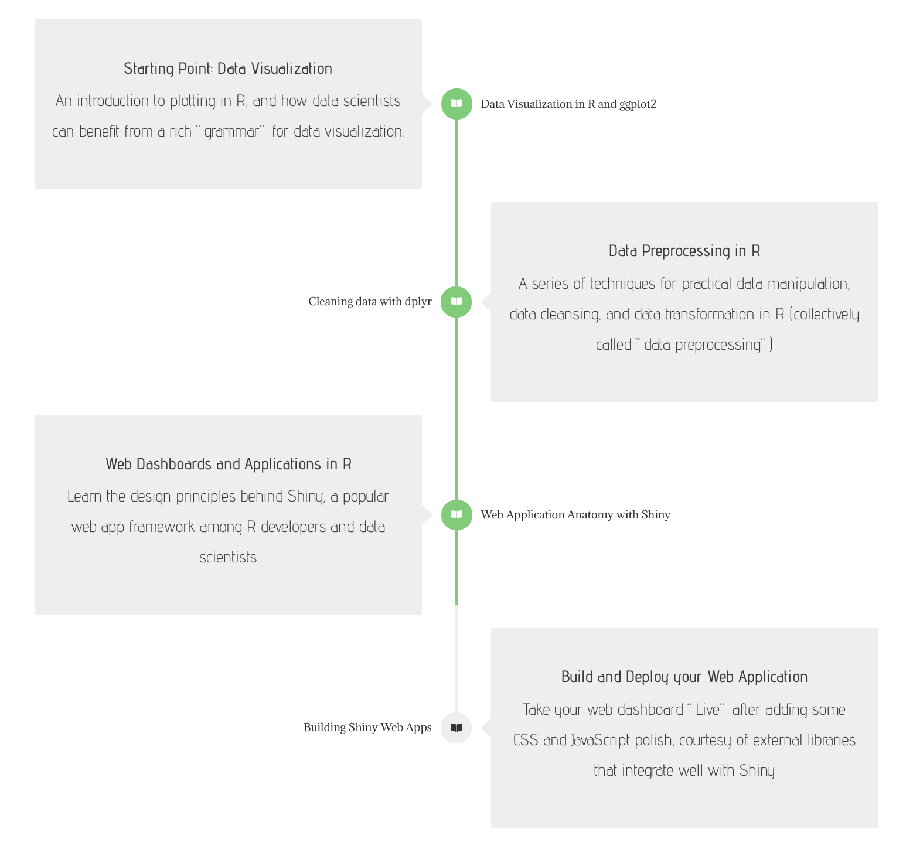

# covid-19 dashboard

The repo contains code references and materials used in a [10-part tutorial series](https://finetut.com/courses/build-covid-web-dashboard-in-r/) on developing a real-time analytics app to monitor the covid-19 (coronavirus) situation, and in the process learn about:
- Data visualization in base R  
- Data visualization using `ggplot2`  
- Cleaning and transforming data using `tidyverse` libraries: `dplyr`, `tidyr` etc  
- Web app / dashboard development using `shiny`  

Build and deploy a real-time analytics dashboard (optionally with your custom sub-domain, for free) with this multi-part lesson. The course will walk you through the process of cleaning data, creating highly compelling data visualizations, and then combining them with a web app framework that is pleasant and visually appealing.

By the end of this course, you will have a web dashboard that is deployed and accessible on the web by anyone, on any devices (responsive web design).

## Learning Outcomes

- Learn to develop a modern, reactive web application using R and the Shiny Web App framework
- Learn to use one of the most popular, powerful data visualization library (ggplot) to create compelling visuals on the web
- Learn to take advantage of modern web development practices such as Bootstrap 4, responsive web design, and UX thinking
- Learn how a framework like Shiny allows you to author your application by transforming your R code into HTML, CSS and JavaScript.
- Learners are expected to develop their own dashboard, and deploy to the free shinyapps.io hosting service. 

## The Learning Journey

### Course Content:
- **Part 1: Starting Our Project**
    - Course 1: High Level Overview: A Covid-19 Web Analytics App
    - Course 2: Introduction to RMarkdown (R Notebook)
- **Part 2: Data Visualization in R**
    - Course 3: Base Plotting in R
    - Course 4: Grammar of Graphics, ggplot2, in R
- **Part 3: Data Cleansing and Transformation in R**
    - Course 5: Grammar of Data Manipulation, dplyr, in R
    - Course 6: Structuring your R Scripts
- **Part 4: Web Application Development in R**
    - Course 7: The Shiny Web Application Anatomy
    - Course 8: Developing a Shiny Web App
    - Course 9: Developing a Shiny Web App (Part 2)
    - Course 10: Launch and Deploy your real-time Web Dashboard

Tutorial Link: [https://finetut.com/courses/build-covid-web-dashboard-in-r/](https://finetut.com/courses/build-covid-web-dashboard-in-r/)

## Other Useful Repositories

1. DarkerShiny, [A Shiny web app template using a dark theme with support for custom CSS](https://github.com/onlyphantom/darkershiny)

2. CoronaVirus, [A Shiny Web App tutorial inspecting the COVID-19 (2019-nCoV) epidemic](https://github.com/onlyphantom/coronavirus)

The code is updated for R 3.6.+ and the data source is:
- https://github.com/CSSEGISandData/COVID-19 (2019 Novel Coronavirus COVID-19 (2019-nCoV) Data Repository by Johns Hopkins CSSE)

